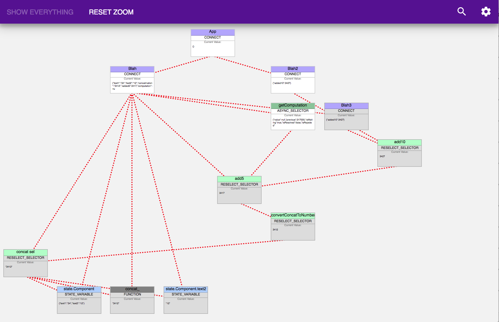

# What it's for
It is used easily visualize the dependency graph of a javascript application. It is specially targeted towards react/redux/reselect applications however it will be useful for any javascript application written in a functional style.

# How to use it
This library create a dependency graph where each node is one of the following:
* plain javascript function
* react-redux connected Component
* reselect selector
* async-selector selector
* redux state variable

This library was designed to be a user friendly as possible. The entire dependency graph is generated at runtime with a minimum of user input. All you have to do is wrap any code you want to be included in the dependency graph in the `graph.vis()` method.

## Initial setup
```
import { createStore } from 'redux';
import reducer from './reducers';
import graph from './vis2/vis';

const store = graph.watchReduxStore(createStore(reducer));

store.subscribe(() => {
  // Optionally update the chrome extension every time a dispatch is invoked.
  graph.displayGraphInExtension();
});
```

## Use on a function
```
import graph from 'redux-visualize';

function myFunction_(x) {
  return x + 15;
}
const myFunction = graph.vis(myFunction_);
```

## Use on a reselect selector
```
import graph from 'redux-visualize';
import { createSelector } from 'reselect';

const stateVar = state => state.x;

function myFunction_(x) {
  return x + 15;
}
const mySelector = graph.vis(createSelector)([stateVar], myFunction_); 
```

## Use on a async-selector selector
```
import graph from 'redux-visualize';
import createAsyncSelector from 'async-selector';

const stateVar = state => state.x;

async function myAsyncFunction_(x) {
  return x + 15;
}
const mySelector_ = graph.vis(createAsyncSelector)({
  sync: x => 0,
  async: myAsyncFunction_,
}, stateVar); 

```

## Use on a react-redux component
```
import graph from 'redux-visualize';
import React from 'react';
import { connect } from 'react-redux'

const MyComponent = props => <div />

const mapState = state => ({});

const MyConnectedComponent = graph.vis(connect)(mapState, null)(MyComponent);
```
# How it works
## Basics
The basic idea is that it uses the function call stack to construct the dependency graph by injecting listeners into any functions the user wants. 
```
// basic code for tracking function calls
function listen(f) {
  return (...params) => {
    stack.push(node);
    const result = f(...params);
    const childNode = stack.pop();
    childNode.setDependency(node);
    return result;
  }
}
```

## State variables
State variables aren't functions so looking at the function call stack doesn't really work. So the naturally we must cheat. Javascript fortunately has the [feature](https://javascriptplayground.com/es5-getters-setters/) of having getters and setters which invoke a function without the user even having know it. With this trick we can actually convert every state variable in the redux tree into a function. Problem solved! The `graph.watchReduxStore()` actually alters the `getState()` method to return this altered state tree.
```
function watchReduxStore(store) {
  const getState = store.getState;
  store.getState = (...params) => {
    const unmodifiedState = getState(...params);
    const magicState = addMagic(unmodifiedState);
    return magicState;
  }
  return store;
}
```
## React Components
The call stack technique won't work on React components because they don't work that way (Neither does tracking the lifecycle methods). Instead we can use the React [Context API](https://reactjs.org/docs/context.html) to tell any child components what their parent component is.

```
function listen(Component) {
  return (props) => <ParentContext.Consumer>
  {
    (parent) => {
      parent.setDependency(node);

      return <ParentContext.Provider value={node}>
        <Component {...props} />
      </ParentContext.Provider>
    }
  }
  </ParentContext.Consumer>
}
```

## Getting node names
the `graph.vis()` method has an optional second parameter for specifying what the name of the node. If that isn't provided it will try to guess a name based on the information provided. If it can't guess the name, it will just use a default name;
```
function getFunctionName(func, defaultName=null) {
    if (typeof defaultName === 'string') return defaultName;
    if (func && func.name && func.name !== '') return func.name;
    return constants.DEFAULT_NAME;
}

function getNameFromComponent(comp, defaultName=null) {
    if (typeof defaultName === 'string') return defaultName;
    if (comp && comp.constructor && comp.constructor.name !== 'Function') return comp.constructor.name;
    if (comp && comp.name !== '') return comp.name;
    return constants.DEFAULT_NAME;
}
```
