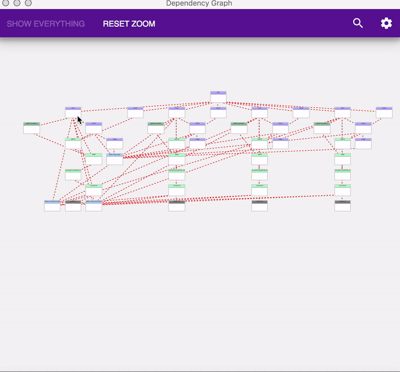

# What it's for
It is used easily visualize the dependency graph of a javascript application. It is specially targeted towards react/redux/reselect applications however it can be useful to just about any web application.

Questions it answers:
* What is the overall architecture of the application
* Which components are dependent on a given state variable
* Which state variables are dependencies of a given component
* Which selectors are having performance issues
* What is the current value cached inside of a selector
* Which file is the parent component in

# How to use it
This library creates a dependency graph where each node is one of the following:
* plain javascript function
* react-redux connected component
* normal react component
* reselect selector
* async-selector selector
* redux state variable

## Initial setup

First install the [Chrome Extension](https://chrome.google.com/webstore/detail/redux-visualize/pmpgeljjhciaifaipibkhljkppdagkea)

Next enhance the store to enable time-travel debugging and include state variables in the dependency graph.
```
import { createStore } from 'redux';
import reducer from './reducers';

const store = createStore(
  reducer,
  undefined,
  createStore => window.graph.enhanceCreateStore(createStore),
);

```

## Use on a function
```
import graph from 'redux-visualize';

function myFunction_(x) {
  return x + 15;
}
const myFunction = window.graph.add(myFunction_);
```

## Use on a reselect selector
```
import graph from 'redux-visualize';
import { createSelector } from 'reselect';

const stateVar = state => state.x;

function myFunction_(x) {
  return x + 15;
}
const mySelector = window.graph.add(createSelector)([stateVar], myFunction_); 
```

## Use on a async-selector selector
```
import graph from 'redux-visualize';
import createAsyncSelector from 'async-selector';

const stateVar = state => state.x;

async function myAsyncFunction_(x) {
  return x + 15;
}
const mySelector_ = window.graph.add(createAsyncSelector)({
  sync: x => 0,
  async: myAsyncFunction_,
}, stateVar); 

```

## Use on a react-redux component
```
import graph from 'redux-visualize';
import React from 'react';
import { connect } from 'react-redux'

const MyComponent = props => <div />

const mapState = state => ({});

const MyConnectedComponent = window.graph.add(connect)(mapState, null)(MyComponent);
```

## Long-term use
There are two problems with approach shown above. Firstly, this code will break for anyone who doesn't have the chrome extension. Secondly, this code will be very hard to remove when used in a production environment. To handle this, it is recommended to create a file which handles these issue and export the required functions. For example:
```
function isInProduction() {
  // Whatever logic you need
  return process.env.REACT_APP_ENV === 'production';
}

// These methods will do nothing, and can be used in production
const noopGraph = {
  enhanceCreateStore: f => f,
  add: f => f,
};

// This is the actual object injected by the extension
const realGraph = window.graph;

const graph = isInProduction() && realGraph ? realGraph : noopGraph;

export function add(f) {
  return graph.add(f);
}

export function enhance(createStore) {
  return graph.enhanceCreateStore(createStore);
}
```


# How it works
## Basics
The basic idea is that it uses the function call stack to construct the dependency graph by injecting listeners into any functions the user wants. 
```
// basic code for tracking function calls
function listen(f) {
  return (...params) => {
    stack.push(node);
    const result = f(...params);
    const childNode = stack.pop();
    childNode.setDependency(node);
    return result;
  }
}
```

## State variables
State variables aren't functions so looking at the function call stack doesn't really work. So the naturally we must cheat. Javascript fortunately has the [feature](https://javascriptplayground.com/es5-getters-setters/) of having getters and setters which invoke a function without the user even having know it. With this trick we can actually convert every state variable in the redux tree into a function. Problem solved! The `graph.watchReduxStore()` actually alters the `getState()` method to return this altered state tree.
```
function watchReduxStore(store) {
  const getState = store.getState;
  store.getState = (...params) => {
    const unmodifiedState = getState(...params);
    const magicState = addMagic(unmodifiedState);
    return magicState;
  }
  return store;
}
```
## React Components
The call stack technique won't work on React components because they don't work that way (Neither does tracking the lifecycle methods). Instead we can use the React [Context API](https://reactjs.org/docs/context.html) to tell any child components what their parent component is.

```
function listen(Component) {
  return (props) => <ParentContext.Consumer>
  {
    (parent) => {
      parent.setDependency(node);

      return <ParentContext.Provider value={node}>
        <Component {...props} />
      </ParentContext.Provider>
    }
  }
  </ParentContext.Consumer>
}
```

## Getting node names
the `graph.vis()` method has an optional second parameter for specifying what the name of the node. If that isn't provided it will try to guess a name based on the information provided. If it can't guess the name, it will just use a default name;
```
function getFunctionName(func, defaultName=null) {
    if (typeof defaultName === 'string') return defaultName;
    if (func && func.name && func.name !== '') return func.name;
    return constants.DEFAULT_NAME;
}

function getNameFromComponent(comp, defaultName=null) {
    if (typeof defaultName === 'string') return defaultName;
    if (comp && comp.constructor && comp.constructor.name !== 'Function') return comp.constructor.name;
    if (comp && comp.name !== '') return comp.name;
    return constants.DEFAULT_NAME;
}
```